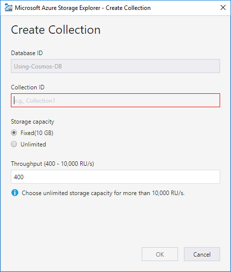
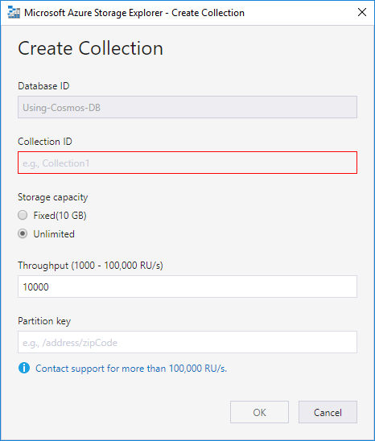
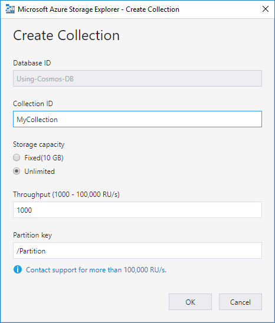

# Part 2: Creating a Cosmos DB Database

If comparing Cosmos DB to SQL Server and the containers you have there, Cosmos DB also has its similar containers. These can roughly be mapped as follows:

| SQL Server | Cosmos DB     |
|------------|---------------|
| Server     | Account       |
| Database   | Database      |
| Table      | Collection    |
| Row        | JSON Document |

There are of course a lot of difference between these, but maybe the biggest conceptual difference is in *tables* vs. *collections*. In SQL Server, each row in a SQL Server table must follow the same schema, where as each JSON document in a Cosmos DB collection can be more or less anything, as long as it is a valid JSON document. There are a few things that apply to each JSON document that is stored in Cosmos DB, but I'll go through those more in detail in [part 3](Part03-readme.md).

## Scaling Considereations
Before creating a new collection read [this document](Part02-scaling.md) that describes the considerations you have to make. Some of those settings cannot be changed after a collection has been created.

## Creating a Collection
Now that you know about the very basics, it is time to create a collection. You can create new collections on the [Azure portal](https://portal.azure.com/), or the data explorer that comes with your local Cosmos DB emulator, but I'll use the [Azure Storage Explorer](https://azure.microsoft.com/en-us/features/storage-explorer/) that I wrote about in [Part 1](Part01-readme.md).

If you are using the local Cosmos DB emulator, you can connect to it using the Storage Explorer. Likewise, if you don't have the emulator, you can connect to a Cosmos DB Account that you have setup in the Azure Portal.

Right-click the Cosmos DB account or your local emulator in the Storage Explorer, and select `Create Database`. Then right-click the database and select `Create Collection`. The dialog by default looks like this:

Under *Storage capacity* if you select *Fixed(10 GB)* you will basically have a single-partition collection, with a maximum storage limit of 10 GB. As I wrote in [scaling considerations](Part02-scaling.md), I would alway go for the *Unlimited* options, because that means you will have a multi-partition collection. When you select that option, the dialog looks like this.

The first thing you need to note is that the troughput went up from 400 RU/s to 10000 RU/s. If you don't change that and you create the collection in Azure and not your local emulator, that will cost you about 0,70 EUR / hour, or about 16,20 EUR / day, which translates to 485 EUR / month.

So, you need to scale that down. On the dialog you can go as low as 1000 RU/s, which is still 48,6 EUR / month. After you created the collection, you can then scale it down to 400 RU/s. The you get the cost down to around 19,4 EUR / month.

The second thing you have to address at this point, is the *Partition key*. The partition key is the path to the property in all JSON documents stored in the collection that will contain the value that determines the partition the document will be stored in. Documents with the same value are stored in the same partition. Documents with different values *may* be stored in the same partition too, but that is something which is totally controlled by Cosmos DB and out of your control.

I'll talk more about the partition key in the [Part 3](Part03-readme.md) of this tutorial, but generally, you should try to design your data model so that you get as many partitions as possible and that you have an even share of data across all partitions. I know, that is quite hard, if not even impossible, to know before the data is stored, but at least consider it for a moment.

The most important thing what I think about partitioning your data is that you should design your data model so that you get as many partitions as possible, but in a way that you know the partion you are querying from. Yes, you can enable cross-partition queries in your collection, but at least you should try to keep your queries within a single partition, and then execute several queries, if necessary.

What I mean by this is that the partition key should be such that you know the value before querying it. For instance, if you have content associated with the users of your application, a user identifier may be part of your partition key. If you have content associated with geographical locations, then the geographical area might be a good candidate for part of the partion key.

This is probably the hardest thing to figure out in advance, so you really should spend time on considering your partition strategy. There are no generic rights or wrongs, so I'm afraid I cannot help you furhter with this subject.

So, from this, we can then create the new collection as shown in the picture below.

.

*Storage capacity* has been set to `Unlimited`, throughput to `1000 RU/s`, and *Partition key* has been set to `/Partition`, just to have some value for now. We'll dig deeper into this in [Part 3](Part03-readme.md).

## Finishing the Collection
