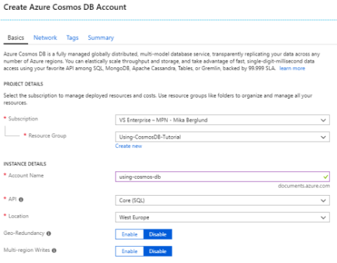

# Part 2: Creating a Cosmos DB Database

If comparing Cosmos DB to SQL Server and the containers you have there, Cosmos DB also has its similar containers. These can roughly be mapped as follows:

| SQL Server | Cosmos DB     |
|------------|---------------|
| Server     | Account       |
| Database   | Database      |
| Table      | Collection    |
| Row        | JSON Document |

There are of course a lot of difference between these, but maybe the biggest conceptual difference is in tables vs. collections. In SQL Server, each row in a table must follow the same schema, where as each JSON document in a collection can be more or less anything, as long as it is a valid JSON document. There are a few things that apply to each JSON document that is stored in Cosmos DB, but I'll go through those more in detail in [part 3](Part03-readme.md).

## Creating an Account
So, the first thing you need to do is creating an account.

